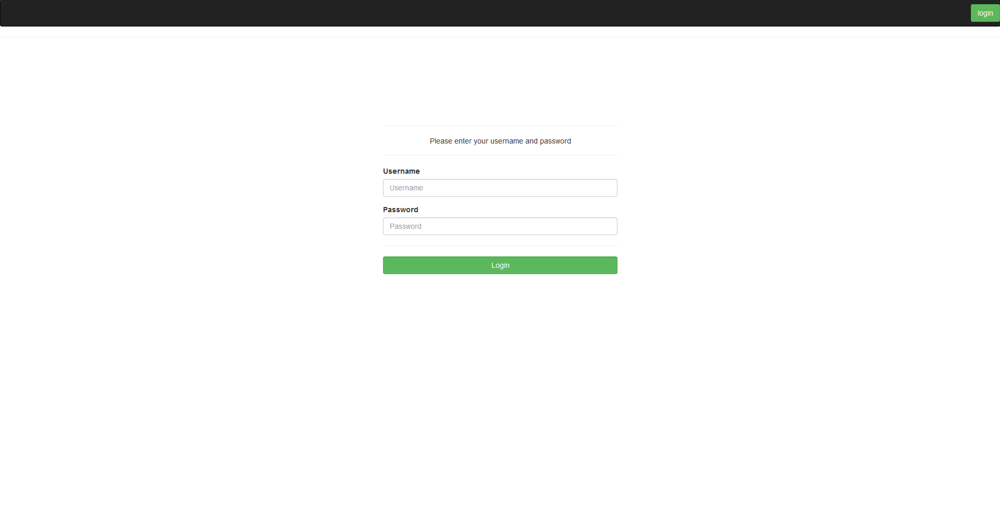
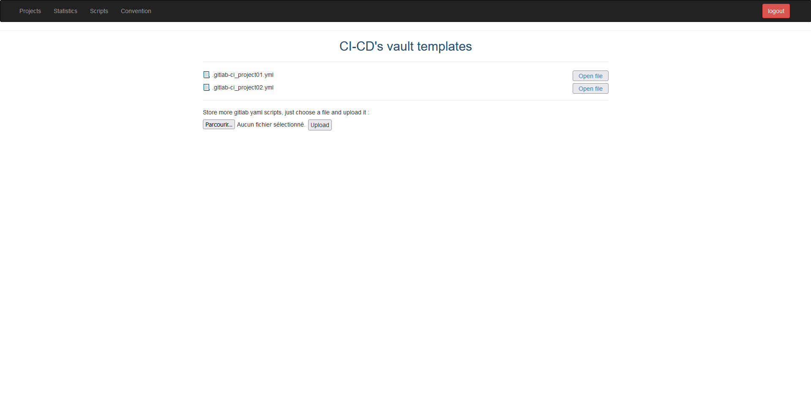
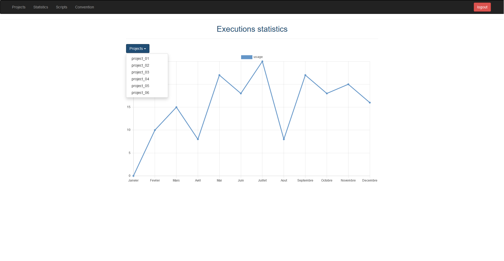
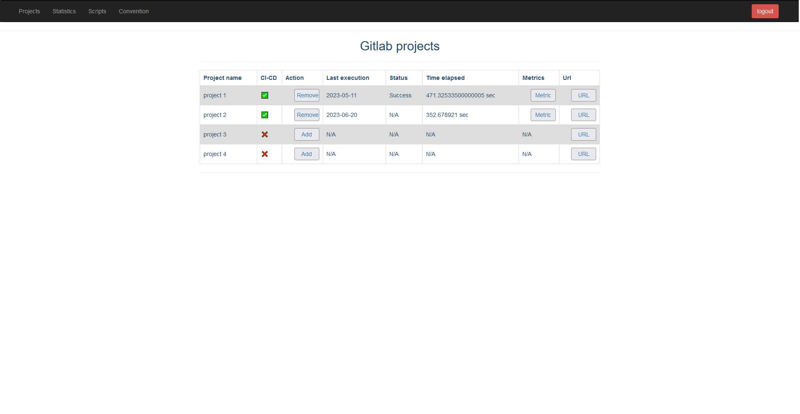
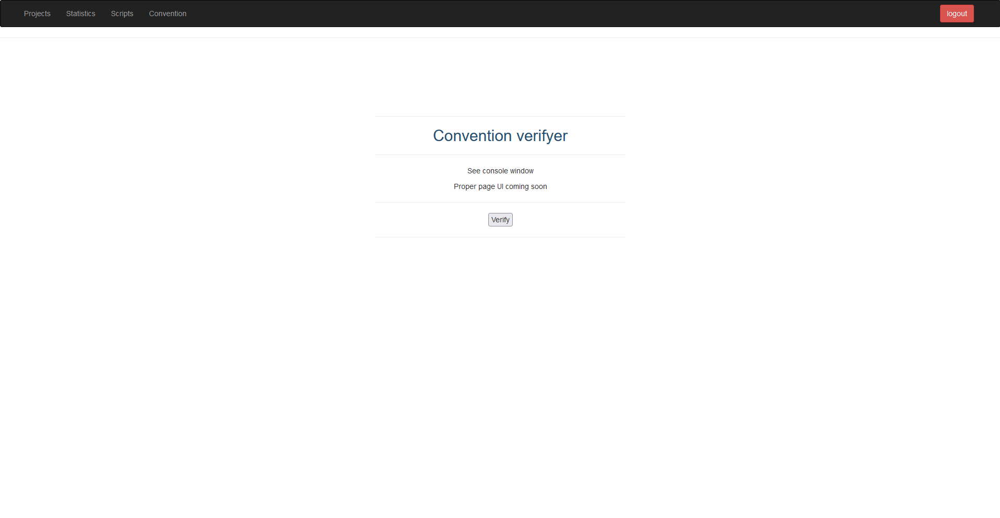

## Description:
Devops Command Center is a web application (in progress) connected to GitLab that provides statistical measurements of continuous integration (CI) processes. It also automates actions such as adding new GitLab CI configurations to new projects using templates and stores them inside a vault for further modification. Basically it is a tool for DevOps tasks and project management.

## Features (actual):

- Authentication: The application includes user authentication with features such as login, registration, and session control.

    

- CI-CD Script Storage: Users can store and manage CI/CD scripts, with the ability to upload and organize script files.

    

- Activity Metrics: The app offers activity metrics and statistics related to GitLab projects and CI/CD processes.

    

- GitLab CI Installation and Automation: The application can automate the installation of GitLab CI configurations within new projects using predefined templates.

    

- Gitlab group and project conventions verifier: DCC can verify the naming of each project and groups and report those who are not compliant.

    

## Running the Application:

- Ensure you have the required Python packages installed. You can install them using 

        pip install -r requirements.txt.

- Set up environment variables in the .env file:

        SECRET=your_secret_key
        TOKEN=your_gitlab_access_token
        gitlab_url=https://gitlab.example.com
        teams_url=https://teams.example.com

- Run the application using: 

        python app.py

## Usage:

- Visit the application in your web browser (default address: http://127.0.0.1:5000/).

- Log in or register to access the various features.

- Use the navigation to access different pages, such as project lists, CI/CD analysis, metrics, statistics, and convention verification.

Note:

- The provided code is a work in progress and require additional functionality and improvements.
